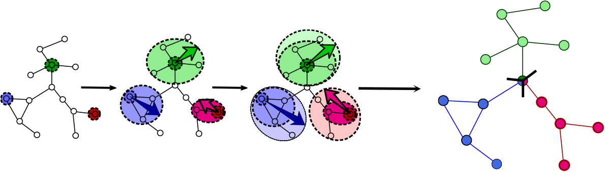

---

__*Distributed Neighbor Expansion (Distributed NE)*__ : A scalable parallel and distributed graph partitioner for high-quality edge partitioning, which has several key features:

- __Low-memory and high-performance implementation__
- __Provide high-quality edge partitionins__
- __Scalable to trillion-edge graphs on 200+ machines__ (1 trillion = 1,000,000,000,000)



*Reference*    

> M. Hanai, et.al. *"Distributed Edge Partitioning for Trillion-edge Graphs"* (PVLDB 2019, [Paper](https://arxiv.org/pdf/1908.05855.pdf))

## Quick Start

```bash
$ git clone git@github.com:masatoshihanai/DistributedNE.git
$ cd DistributedNE; mkdir build; cd build
$ cmake ..; make ## Require MPI
$ mpirun -n 4 ./DistributedNE ../data/Slashdot.edges 4
```

#### For more info, please see our project page >>> [DistributedNE](http://www.masahanai.jp/DistributedNE/)

